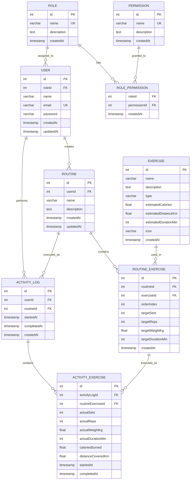

# Interfaces 3 - 2026 02

## Sistema de Gestión de Rutinas y Actividad Física

Una empresa que ofrece servicios relacionados con el bienestar y la actividad física desea desarrollar una aplicación para ayudar a sus usuarios a organizar sus entrenamientos y llevar un control de su progreso. Actualmente, muchas personas utilizan hojas de cálculo, notas en el celular o aplicaciones genéricas para registrar sus actividades, lo que dificulta mantener un historial ordenado y consultar los resultados obtenidos a lo largo del tiempo. Por esta razón, se busca construir una solución que permita a cada usuario crear planes de entrenamiento personalizados, compuestos por diferentes actividades físicas, y utilizarlos durante sus sesiones diarias. Cuando una persona realice un entrenamiento, la aplicación deberá permitir registrar lo que efectivamente hizo, ya que en ocasiones los resultados obtenidos pueden diferir de lo que se había planeado inicialmente. También se desea conservar un historial de las sesiones realizadas para que los usuarios puedan revisar su evolución y analizar su desempeño. Adicionalmente, la organización considera importante que no todas las personas tengan acceso a las mismas funcionalidades dentro de la plataforma, por lo que será necesario contemplar diferentes tipos de usuarios con distintos niveles de acceso. Como parte del proyecto, se espera diseñar una solución que permita almacenar y gestionar toda la información necesaria para soportar estas necesidades de negocio de forma organizada y consistente.

<details>
<summary><strong>Ver propuesta de modelo de datos (solución sugerida)</strong></summary>



</details>

## Base de Datos

### Sembrado de Datos Iniciales (Seed)

Para ejecutar el script de inserción de datos iniciales en la base de datos PostgreSQL alojada en Docker, ejecuta el siguiente comando:

```bash
docker compose exec -T db psql -U postgres -d mydatabase < db/scripts/inserts.sql
```

## Puesta en marcha

```bash
cp .env.example .env          # ajusta JWT_SECRET si lo deseas
docker compose up -d          # PostgreSQL
npm install
npm run start:dev             # TypeORM crea las tablas (synchronize=true)
docker compose exec -T db psql -U postgres -d mydatabase < db/scripts/inserts.sql   # seed (con la app ya iniciada una vez)
```

El seed es re-ejecutable: limpia las tablas y reinicia los ids antes de insertar.

Usuarios de prueba:

| Usuario | Contraseña | Rol |
|---|---|---|
| `admin@gym.com` | `Admin123*` | admin |
| `juan@example.com`, `maria@example.com`, `carlos@example.com`, `ana@example.com` | `User123*` | user |

## Autorización por permisos

Cada petición pasa por `AuthGuard('jwt')` (autenticación, 401 si falta o es inválido el token) y luego por `PermissionsGuard`, que compara los permisos del rol del usuario con los declarados en el método mediante `@Permissions(...)` (403 si falta alguno). Los permisos se leen de la base de datos en cada petición, por lo que revocar un permiso a un rol surte efecto de inmediato.

### Permisos y roles

| Permiso | admin | user |
|---|:---:|:---:|
| `create_routine`, `read_routine`, `update_routine`, `delete_routine` | ✔ | ✔ |
| `create_activity`, `read_activity`, `update_activity`, `delete_activity` | ✔ | ✔ |
| `read_exercise` | ✔ | ✔ |
| `manage_exercises` | ✔ | ✘ |
| `manage_users` | ✔ | ✘ |
| `manage_roles` | ✔ | ✘ |

### Endpoints y permiso requerido

| Recurso | Ruta | Operaciones y permiso |
|---|---|---|
| Usuarios | `/users` | Todas: `manage_users` |
| Roles | `/roles` | Todas: `manage_roles` |
| Permisos | `/permissions` | Todas: `manage_roles` |
| Rol-Permiso | `/role-permissions` | Todas: `manage_roles` |
| Ejercicios | `/exercises` | GET: `read_exercise` · POST/PATCH/DELETE: `manage_exercises` |
| Rutinas | `/routines` | POST: `create_routine` · GET: `read_routine` · PATCH: `update_routine` · DELETE: `delete_routine` |
| Ejercicios de rutina | `/routine-exercises` | GET: `read_routine` · POST/PATCH/DELETE: `update_routine` (modificar el contenido de una rutina) |
| Sesiones | `/activity-logs` | POST: `create_activity` · GET: `read_activity` · PATCH: `update_activity` · DELETE: `delete_activity` |
| Ejercicios realizados | `/activity-exercises` | Igual que sesiones |
| Login | `POST /auth/login` | Público |

Todos los recursos exponen el CRUD completo: crear (`POST /recurso`), listar (`GET /recurso`), consultar por id (`GET /recurso/:id`), actualizar (`PATCH /recurso/:id`) y eliminar (`DELETE /recurso/:id`).

## Verificar accesos autorizados y denegados

Con la app en marcha y el seed cargado:

```bash
./api-tests/verify-authorization.sh          # 19 comprobaciones (401, 403, 200, 201, 204)
```

También se puede importar `api-tests/postman_collection.json` en Postman y ejecutarla con el Collection Runner (40 peticiones con aserciones: login, accesos denegados y accesos permitidos para `admin` y `user`).
